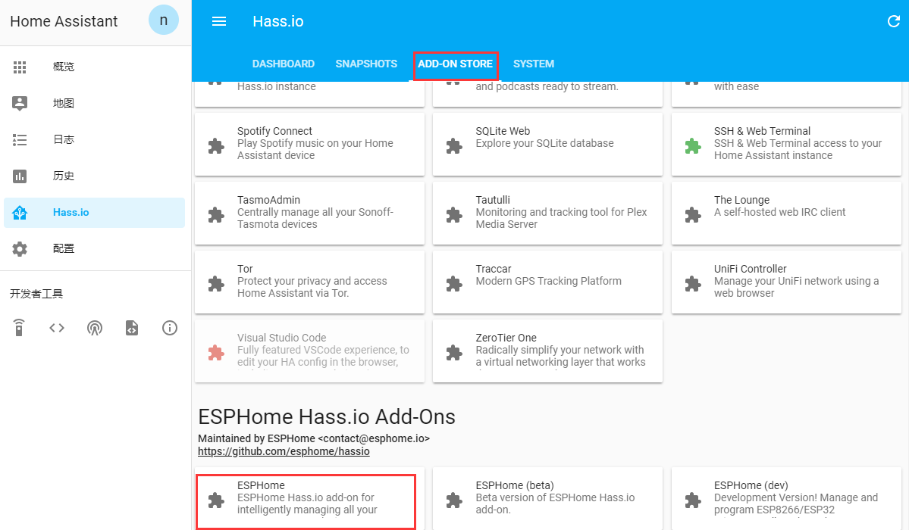
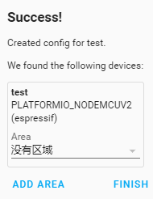
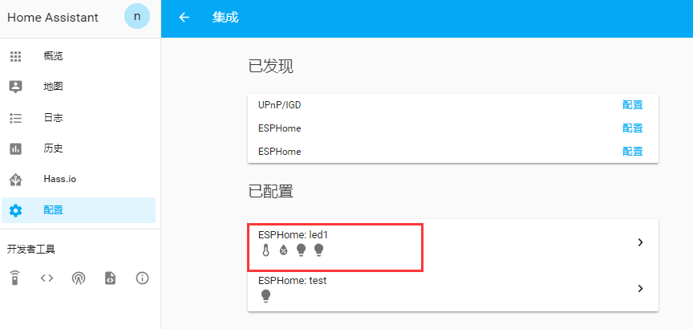
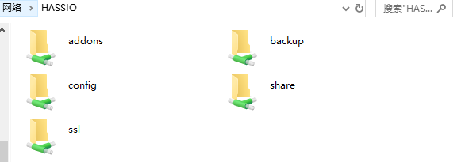
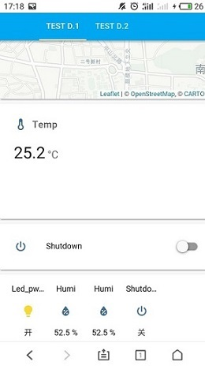

#  智能家居平台Home Assistant初探

#  ——Hass.io的配置、安装与使用


[Home Assistant](https://home-assistant.io/) 是一个基于 Python 3 开发的开源家庭自动化平台。可以跟踪和控制家庭中的所有设备，并实现自动化控制。不同于商业化的平台，Home Assistant 依托的是庞大的社群，目前支持 779 种不同组件，在 Github 上还有更多的定制组件，0.50 版本后，能够直接接入小米设备。它最大的优势在于丰富的自动化配置以及高度自由的定制化。


[树莓派](https://www.raspberrypi.org/) 是由树莓派基金会研发的一种只有信用卡大小的单板机电脑，最初的设计目标是用较为廉价的硬件和开源软件为儿童提供一个计算机教育平台。但其优秀的扩展性和易于开发的特性，使其不仅仅用于儿童教育，更是成为了极客们的玩具。树莓派被开发出了千千万万种玩法，并且普通人也可以轻松实现。感兴趣的请深入阅读“少数派”的文章[树莓派入门指南](https://sspai.com/post/38542)。

经过众多版本的迭代以及社区成员的贡献，Home Assistant 支持大部分平台，包括 Docker、macOS、Linux、Windows 等。在树莓派上安装 Home Assistant 有多种方式，你可以选择在树莓派 Raspbian 系统下安装，也可以之间安装集成了 Home Assistant 的 Hassbian 操作系统。

我选择2017年发布的 Hass.io 集成系统，全可视化安装配置，基 [Docker](https://www.docker.com/) 和  [ResinOS](https://resinos.io/) 。


## 一、下载镜像文件与烧录：

1. 准备一张大于32G的TF卡，使用SDformatter进行格式化：

   

2. 在[Home Assistant官网](https://www.home-assistant.io/)选择合适的镜像文件进行**[下载](https://www.home-assistant.io/hassio/installation/)**;

3. 烧录工具采用Etcher，可在**[官网](https://www.balena.io/etcher/)**进行下载：

4. 将格式化后的SD卡接入PC端口后，打开Etcher软件，并选择下载下来的hassos_rpi3-2.11.img.gz镜像文件，进行烧录：


4. 烧录完成，开始进行网络的配置。


## 二、网络环境的配置：

​        **树莓派的网络连接，可以在插入TF卡后采取线直连的方式的方式。但在很多环境情况下，采用WiFi的方式使用起来更为便捷，但是配置的过程中就会遇到很多问题，相对要复杂得多：**

1. 在使用WiFi得情况下，利用读卡器将烧好程序得TF卡继续接如Window系统端口下（Mac无法读取），并在树莓派系统盘：Hassos-boot下创建文件夹:CONFIG/network，最终在该路径中创建文本文件“my-network”:

2. 将网络配置的主要参数，写入该文本文件中并保存，具体设置可参考**[链接](https://github.com/home-assistant/hassos/blob/dev/Documentation/network.md)**:

   ```python
   [connection]
   id=hassos-network
   uuid=72111c67-4a5d-4d5c-925e-f8ee26efb3c3
   type=802-11-wireless
   
   [802-11-wireless]
   mode=infrastructure
   ssid=yuhan888888     # MY_SSID
   
   [802-11-wireless-security]
   auth-alg=open
   key-mgmt=wpa-psk
   psk=yuhan123456      # SSID_KEY
   
   [ipv4]
   method=auto
   
   [ipv6]
   addr-gen-mode=stable-privacy
   method=auto
   ```

3. 创建好网络配置的同时，如果能够保证该局域网在翻墙的代理状态下，进行后续的文件下载将会更加快捷，所以此次采用了ShadowSocket代理服务器进行网络的连接。当然，在非代理环境析也能够进行后续服务的配置下载，但是速度就可能会少微有些缓慢了：

4. 网络配置完成后，即可直接进入IO，但是仍需系统的时间配置，才能使io进入下载环境。


## 三、HassIO系统配置：

**将插在读卡器上的系统TF卡安全退出后，插入树莓派，并连上鼠标与显示器，上电开机：开机后，开始进行加载，但是因为国内时区与外网不同导致依旧无法进行下载。所以，需要进行网络时间的配置，这里提供过了两种方案：**

* **方案一：永久方案**

​                        1）.将将SD卡从树莓派取出放入读卡器，并插入windows电脑；

​                        2）.继续在CONFIG路径下，创建文件“**timesyncd.conf**”；

​                        3）.在该文件下输入以下内容，最后重新放至树莓派并重启：​        

```
[Time]
NTP=0.pool.ntp.org 1.pool.ntp.org 2.pool.ntp.org 3.pool.ntp.org
FallbackNTP=0.pool.ntp.org 1.pool.ntp.org 2.pool.ntp.org 3.pool.ntp.org
```

* **方案二：临时方案**（系统重启后时间会重置）

  ​                   1）.将树莓派连接显示器开机后，便进入了**HassOS**控制台界面，等到控制台加载停止后，在          				以下提示内容中输入root并回车：

  ```python
  Welcome to HassOS
  Hassio login: root               # 输入root然后回车
  ```

  ​                    2）.在hassio提示符下，输入**login**再次**回车**进入系统；

  ​                    3）.直接通过以下命令，进行UTC时间的设置输入，需要在当前**北京时间减去8小时**：

  ```python
  #date -s "2019-04-25 07:31:00"    # 当前时间：15：31：00
  ```

  ​                  4）.最后再输入以下命令，启动系统的设置更新：

  ```python
  #docker pull homeassistant/raspberrypi3-homeassistant:latest
  ```

  更新完成，边完成了网络的配置，控制系统开始更新下载。


## 四、打开Home Assistant:

1. 在hassos控制台加载完成后，即可在同一局域网下的终端上，通过浏览器输入**http://hassio.local:8123**，或是通过hass服务端地址和固定端口（193.168.137.17：8123），登入Home Assistant的Web界面。（ **Android手机只能通过IP:8123访问 **）

   首次登陆，需要进行至少20分装的加载等待：

   

2. 加载完成后，便会跳转至登陆界面进行登陆设置： 

3. 登陆成功后，进入了最后的Home Assistant面板主页面：

4. 如果采用地址登录，可通过登陆路由器并查看终端管理，来获取hassio的地址（或是将树莓派通过手机或PC热点连接网络，并直接查看IP）：

 

3.注意，在登陆Home Assistant之后，需要20分装进行相关配置的下载，具体时间是网速而定。


## 五、远程连接组件配置：

**参考链接地址：https://www.home-assistant.io/addons/ssh/**

1. 打开面板下的Hass.io页面，从add中下载ssh sever控件:

   

2. 更改密匙，保存并启动ssh;

   

3. 下载PUTTY程序：https://www.chiark.greenend.org.uk/~sgtatham/putty/releases/0.71.html

   

4. 打开PUTTY并进行配置后保存，open：

   

5. 打开后会弹出对话框，点击Yes;

   

6. 默认root登陆，并输入设置的密码，便进入了容器，

   

7. 可以通过以下命令进行测试，以查看关键配置文件所在位置：

   

## 六、ESPHome组件的安装：

**参考链接地址：https://esphome.io/guides/getting_started_hassio.html**

**视频资料：http://tieba.baidu.com/p/6098640649**

1. 在导航到Home Assistant前端的Hass.io面板，然后添加ESPHome附加存储库：[https](https://github.com/esphome/hassio)： [//github.com/esphome/hassio](https://github.com/esphome/hassio)。（对于esphomeyaml附加组件，只需添加“ [https://github.com/ottowinter/esphomeyaml 143 ](https://github.com/ottowinter/esphomeyaml) ”存储库）：

   

2. 稍等片刻直到安装了附加组件（这可能需要一段时间）并转到附加页面，再进入ESPHome,继续安装：

   


3. 启动加载项，然后单击“打开Web UI”。

   

   


4. 开始根据向导进行ESP设备的添加：

   1). 设备名设，不能出现中文或大写字母：


​           2). 对设备类型进行选择，ESP系列有很多，但此次我们选择常用的Nodemcu进行试验：


​             3). 进行无线设置，主要是针对ESP所连接的网络进行设置，同时进行访问密码设置，为了方便，与SSID密码相同：


​           4). 设置完成后，提交，便可回到界面看到创建的节点：


说明：创建的节点，具有多种配置，可以执行三种操作（UPLOAD、SHOW LOGS、COMPILE）；upload可以对节点的固件进行编译，并使用USB将其上传至节点设备，也可以使用[OTA组件](https://esphome.io/components/ota.html)无线连接；showlogs则用于查看节点正在输出的所有日志；comlile用于编译固件，并下载生成二进制文件，便于从计算机上上传。

5. 可以通过SSH查看hassio所添加的节点文件：

   

## 七、对Nodemcu的自动化控制：

**参考资料：http://tieba.baidu.com/f?kw=homeassistant&ie=utf-8&tab=main**

1. 在添加完节点后，在hass.io界面的ESPHome插件栏,点击restart按钮重启组件程序，然后将nodemcu插入树莓派的端口，便可以在ESPHome右上角位置选择设备了：

   

2. 打开EDIT按钮，开始进行yaml的配置文件编写，将对nodemcu的功能进行简单设置并SAVE：
      
      

3. 通过VALIDATE对配置文件进行调试，以检查配置文件的正确性：
      
      

4. 再点击UPLOAD按钮，将会根据配置文件生成固件，并上传至设备。首次上传会进行相关软件的安装和初始化编译，过程会比较长：
    ​    
      

5. 在上传成功之后，便回到Home Assistan主页面，找到配置：

    

    

6. 填入节点的ip地址和端口，节点IP 地址可在UPLOAD时的页面中查看，最后输入节点密码：

    
    

    7. 配置完成，便可在配置界面看到灯控制的按钮了，一边点击按钮一边对Nodemcu的灯亮度进行观察，现在已经初步实现了对组件的应用和控制器的自动化控制了：

       

       

## 八、外部传感设备的连接：

**传感器配置参考链接：https://esphome.io/index.html#core-components**

1. 停止UPLOAD页面，并重新编写配置，不同的传感设备配置方法可参考上面的官方链接地址：

   

   2. 再次进行调试检测：

      

3. 进行上传（如果上传失败，请返回HA界面的ESPHome服务，进行Restart重启）：

   
4. 在Home Assistant面板的“配置”-“集成”-“设备新集成”-“ESPHome”中再次添加地址和节点端口：


4. 设备添加完成，可以对设备进行检查：

   


## 九、内部主配置文件的管理：

​        **在进行过外部组件的配置后，我们仍需要了解内部的主配置文件以及其配置方式。但首先，我们需要了解远程连接配置文件的方法，毕竟Hassos是没有桌面的定制系统，无法直接通过树莓派进行主配置文件的配置。**

​        **而配置文件的连接，同样需要通过组件来实现，这也体现了组件的价值。我们将通过两种组件下的两种方式来实现配置文件的管理：Web服务端和局域网共享。**


### **Configurator组件：**web文件管理：

1. 打开左侧Hass.io，在Add-on Store种下载**configurator**，下载完成后安装、启动，并进入UI：

   

2. 进入该界面，进行用户名和密码设置，一边保护对配置文件的访问,即便config采用默认配置似乎也没有太大影响：

   

3. 单机左上角的文件夹图标，我们便可以实现对Hassos内部目录文件的访问了。首先找到主配置文件**"configuration.yaml"**，修改“# http”，并为Web界面设置密码，以便访问。最后点击右上角出现的保存按钮即可实现配置文件的初步编辑了：

   

4. 单机菜单右上角菜单按钮，并重新启动Hass:

   

###  **Samba组件：**Windows网络共享管理:

**Smaba 服务是必装的一个插件，Hass.io 通过它与局域网内的其他设备进行文件共享，是之后编辑 Hass.io 配置文件的前提。**

1. 继续回到hass.io，并查找**Smba hare**组件，进行下载。下载后，在config栏进行如下配置并保存（如果使用以太网连接Raspberry Pi，将**interface**设为**eth0**，如果是WiFi连接，则设为**wlan0**）：


2. 运行Samba后，打开window网络共享，直接输入**" \ \HASSIO"**，在弹出的登陆界面，输入正确的用户名和密码进行登陆：


3. 登陆后便可以看到局域网下所共享的树莓派配置文件目录了：




4. 我们可以直接用通过电脑的notepad++对配置文件直接进行配置编辑和保存了：

   


##  十、内部主配置文件的编辑：

​       **配置文件为YAML格式，可以对复杂的配置信息进行具体的编辑，具体的格式要求与配置方法，可以参考[链接](https://www.hachina.io/docs/336.html)进行理解。而此次，我们将通过简单的天气状态配置，来表现其配置文件的便利性：**

1. 根据之上的步骤，我们打开了主配置文件：**"configuration.yaml"**，并确定框1所示的坐标，定位是否正确，可通过百度地铁定位进行确定，再添加sensor进行实体配置：

   

   ```yaml
     - platform: yr
       name: Weather
       forecast: 24           
       monitored_conditions:
         - temperature        
         - precipitation      
         - windSpeed          
         - pressure           
         - windDirection     
         - humidity      
   ```

2. 保存后，重启树莓派Hass服务，并再次打开Home Assistant，在概览中的右上角，我们点击三点图标，便可以看到**“未使用的实体”**了：

   

3. 再次点击，选择**“配置UI”**，再点击**“+”**号，进行卡片添加，选择最后一个卡片：

   

4. 添加实体，保存后退回主UI，便可看到添加的天气配置和卡片了：

   


5. icon 图标设置，采用 [Material Design Icons](https://materialdesignicons.com/) 网站内的图标，在icon: mdi: 后输入想要的图标名称。

   

## 十一、HA的公网连接：Home Assistant Cloud

**Home Assistant平台，主要是面向局域网下的智能系统，但是其依然能够满足公网下的访问需求，比如使用其内部的Home Assistan Cloud,便可以实现公网下任何终端的显示控制了：**

1. 登陆Home Assistant,选择：配置→Home Assistant Cloud:

   

2. Sign In，登陆云端账号密码，（可通过邮箱验证，免费试用一个月）：

   

3. Home Assistant Cloud开始生成并验证证书，完成后，可以通过该链接，进行公网Home Assistant的登陆：


4. 之后便可直接进行远程UI操作了：


