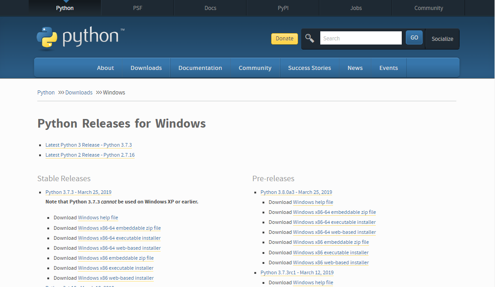
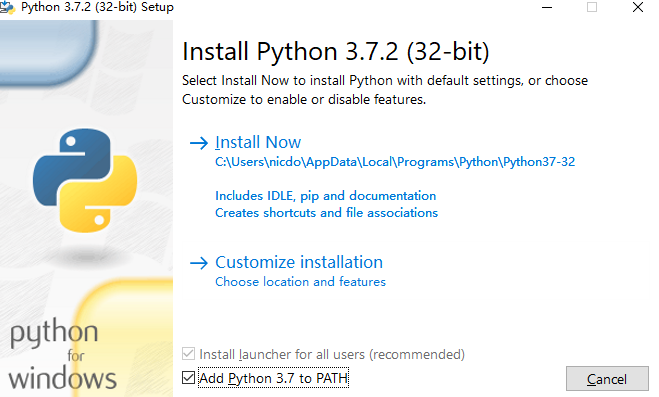
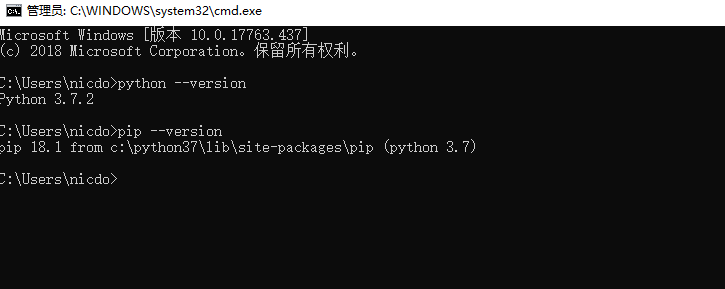
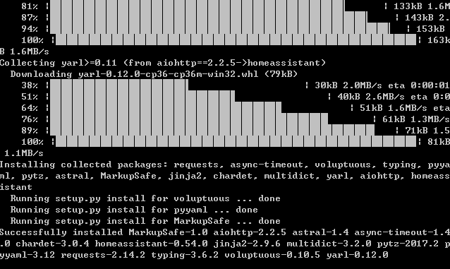

# Windows环境下Home Assistant的搭建

1. 在浏览器中访问**[Python官网]([www.python.org](https://www.python.org/))**,并下载windows环境下的python文件：

   

2. 选择合适的路径安装Python，确保选中Add Python 3.5 to PATH选项，点击Install Now：

   

3. 验证python环境的安装：

   

4 .输入以下命令，进行安装后，等待安装完成：

```python
pip3 install homeassistant
```



5. 用以下命令启动：

```
hass
```

6. 再通过浏览器打开本地服务：http://localhost:8123

   或是通过命令直接打开浏览器：

   ```
   hass --open-ui
   ```

   安装教程：https://www.hachina.io/docs/353.html

7. 主配置文件**“configurator.yaml”**路径为：C:\Users\nicdo\AppData\Roaming\.homeassistant

