# Home Assistant平台的应用与实施计划——五月

## 目标：

在现有对Home Assistant平台得了解基础上，进行智能家居平台的展示设计。

实现的主要展示功能包括：**局域网环境下室内环境数据的采集监测、室外环境的API获取、灯光的自动控制、以及远程控制等、UI平台展示。**

## 实现意义：

Home Assistant是一个开源的物联网平台，主要面向局域网落下的智能家居设计，当然，也可以应用于农业、办公场所以及工业环境下。

通过基础的传感设备接入，进行数据的稳定性观察。而作为众多物联网平台之一的Home Assistant，最大的亮点，便是对众多组件的应用以及各种传感设备的接入。后面也会在有条件的情况下，进行Home kit、小米传感器的接入。

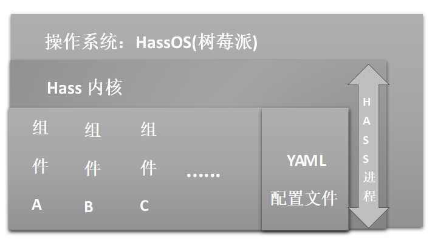

所以，这个平台依然有着众多的亮点待于发掘，而它的应用场景也一定不仅限于家居。这有助于拓展我们在接下来的项目中的平台可选择性，更为接下来的物联网项目设计提供了更多的需求设计的可能性。

## 功能：

1. 可进行用户的分配设置，主要有管理员和用户两个身份：管理员可进行开发配置与管理，包括对用户的管理；而用户仅能进行正常的面板控制等操作：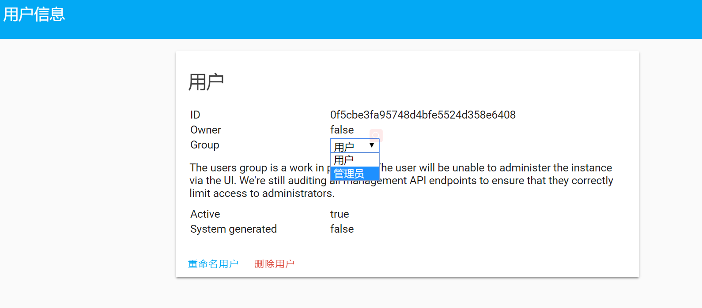

   管理员与普通用户的区别展示;

   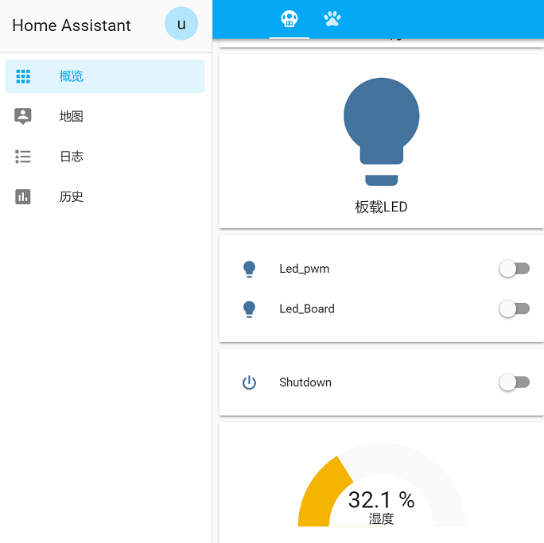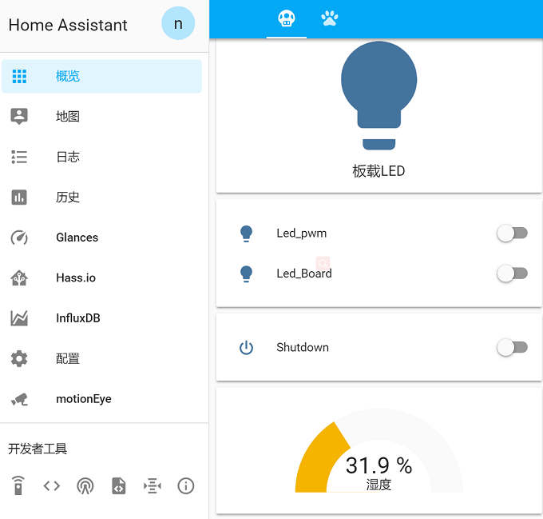

2. 利用组件将Nodemcu接入后，进行引脚及温湿度传感器的配置进行数据采集,并通过设备与服务的集成进行管理：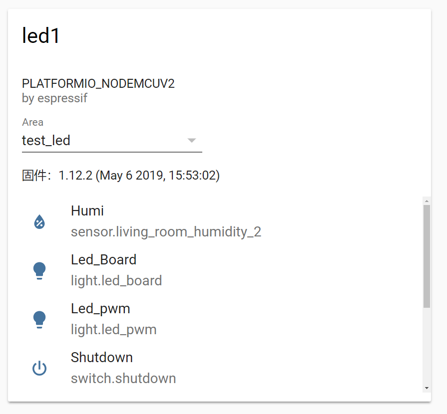

3. 进行自动化配置，实现日出日落条件下，灯光的自动开关：

   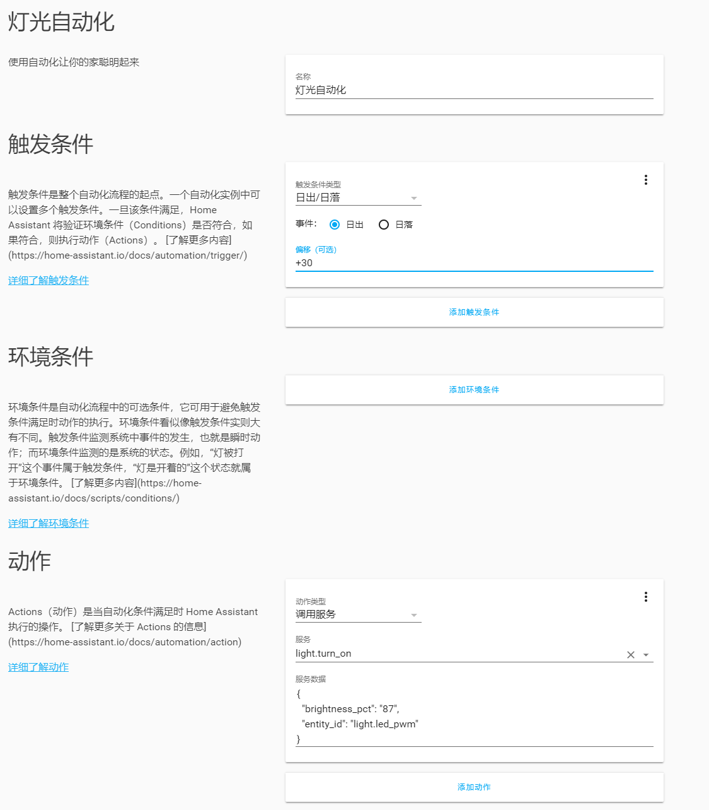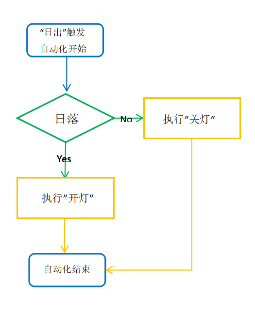

4. 通过对ESPhome配置文件的相关配置，以及其他外围元器件的使用实现对电器的通断电控制：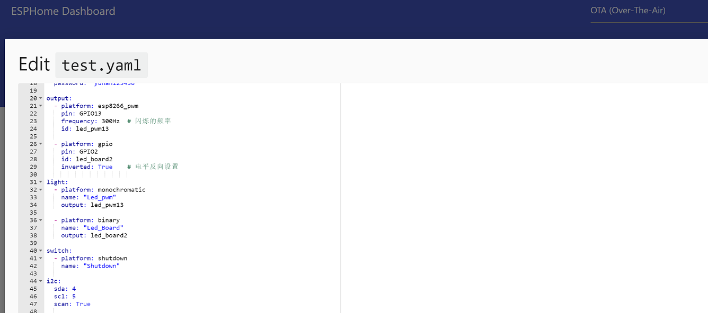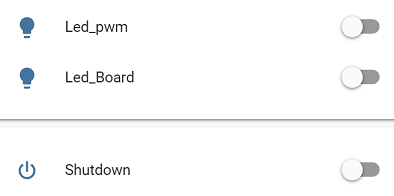

5. 通过主配置文件，进行外部API数据的获取，添加实体：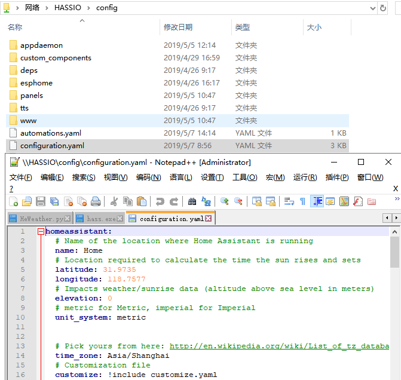

6. 利用组件InfluxDB、Home Panel等进行数据展示分析、控制端UI的优化设计：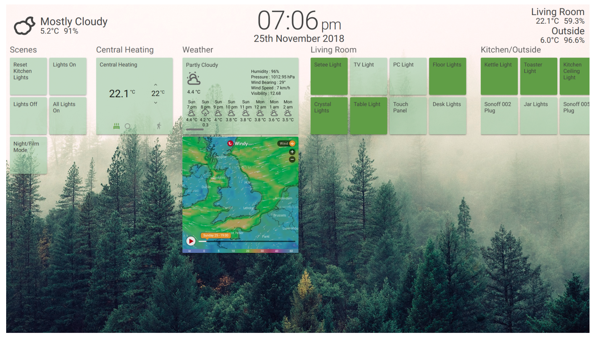

7. 扩展功能：利用Floorplan组件以及SVG平面图设计，进行完全的交互界面设计。仅通过Web 页面，便在平面图中显示、控制所有的设备、服务、场景。

   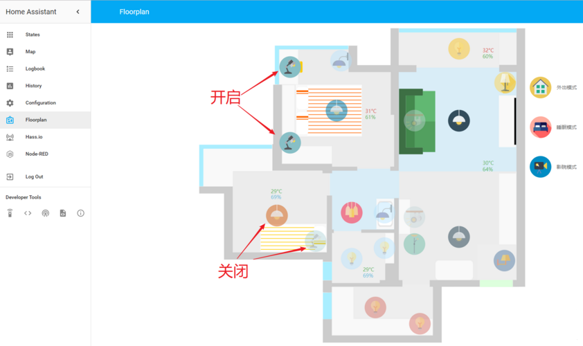

## 材料准备：

**硬件：**路由器、树莓派、TF卡、Nodemcu、温湿度传感器、继电器或光耦开关、显示板、台灯、电脑*

**软件：**流畅的局域网环境、window系统、浏览器、hassos镜像、Etcher工具、notepad编译器

## 预计时间：05.01~05.31